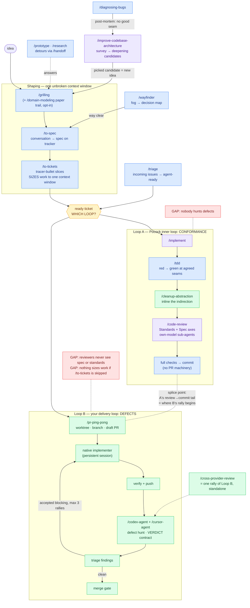

# Skills workflow map — the two delivery loops

**Color = provenance:** blue = Pocock (unmodified) · purple = Pocock, forked by you · green = yours · amber = the open decision · red = coverage gaps (grill fodder).

Not drawn, running underneath everything: `/codebase-design` + `/domain-modeling` (vocabulary layers) and `/handoff` (session bridge).

## Three things to hold in memory

1. **One of your skills already lives inside his loop** — `/cleanup-abstraction` (green) sits mid-pipeline in Loop A. The merge you're contemplating has already happened once.
2. **The loops review disjoint things** — A checks conformance (standards + spec) with the model that wrote the code; B hunts defects with providers that didn't. Running either alone means the other axis never runs.
3. **The splice point** — A ends where B begins (review → commit ≈ rally start). That seam is where "one loop" would be stitched.

## The decisions the grilling has to settle

1. **One loop or two?** Splice B onto A's tail, keep both routed by work-type, or let B absorb A's review axes?
2. **Where does the conformance axis (spec/standards/smells) live in your delivery path?**
3. **Does `/to-tickets` survive as the sizing step, or does ping-pong learn to size/refuse oversized issues?**
4. **Fate of `/cross-provider-review`** — standalone second opinion, or a single-rally mode of ping-pong?
